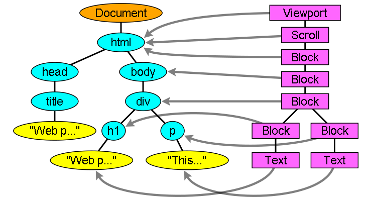

## Exercise 1.1

## Q.1 When a user enters an URL in the browser, how does the browser fetch the desired result ? Explain this with the below in mind and Demonstrate this by drawing a diagram for the same.
    a.What is the main functionality of the browser?
    b.High Level Components of a browser.
    c.Rendering engine and its use.
    d.Parsers (HTML, CSS, etc)
    e.Script Processors
    f.Tree construction
    g.Order of script processing
    h.Layout and Painting

## Answer

Browsers are primarily used to display and access websites on the internet, as well as other content created with programming languages such as HTML or XML. Browsers convert HTTP web pages and websites into human-readable content. When user enters URL in browser, the first thing happen is, browser tries to find out the IP address associated with the domain name. DNS helps in resolving this. (DNS is basically store all data wich contains IP address and domain) it helps us to provide the IP address that is associated with the domain name.

## Main functionality of the browser

The main functions of web browser is to fetch or retrieve informative resources from World Wide Web to the client/user on demand, translate those files received from web server and display those content to the user and allow the client/user to access all other relevant resources & information via hyperlinks.

When the user inputs any URL (uniform resource locator) in the web browser, the user is navigated to that website by the browser quickly. Let us have a look on its processing. When user type any URL, for example https://google.com, the prefix of the URL decide how to retrieve it. The URL prefixes that the web browser is not able to handle directly is sent to related application. Like default email app is responsible to handle mailto: URL prefix.

Web browser allow users to interact with web pages and other dynamic contents via hyperlinks that provides navigation facility i.e. to go to different locations by clicking on links that makes internet surfing easy.

## The browser's main functionality

The main function of a browser is to present the web resource which we choose, by requesting it from the server and displaying it in the browser window. The resource is usually an HTML document, but may also be a PDF, image, or some other type of content. The location of the resource is specified by the user using a URI.

## The browser's high level components

### The user interface: 
this includes the all the component which is visibale. like address bar, refresh button, back/forward button etc.
### The browser engine:
marshals actions between the UI and the rendering engine.
### The rendering engine:
this is behind for all visible content which is requested by user. it parse HTML/CSS/XML content. and renderd it and displayed it on the screen to user.
### Networking:
for network calls such as HTTP requests, using different implementations for different platform behind a platform-independent interface.
### UI backend: 
used for drawing basic widgets like combo boxes and windows. This backend exposes a generic interface that is not platform specific. Underneath it uses operating system user interface methods.
### JavaScript interpreter: 
Used to parse and execute JavaScript code.
### Data storage:
This is a persistence layer. The browser may need to save all sorts of data locally, such as cookies. Browsers also support storage mechanisms such as localStorage, IndexedDB, WebSQL and FileSystem.

## Parsing

Parsing is the process of breaking down code into individual chunks of code, verifying that all necessary inputs are included in the code, and acting on the instructions dictated by the code.

In the context of the Web, parsing most commonly happens when a web browser receives the files that comprise a website. Every web browser is equipped with a rendering engine that converts the files into the web page you see in your browser. The rendering engine contains several parsers – the part of the program that parses code prior to rendering the web page. There is a different parser for every language. At a minimum, any modern browser can parse HTML, CSS, and JavaScript.

## Script processor

The model of the web is synchronous. We expect scripts to be parsed and executed immediately when the parser reaches a script tag.
The parsing of the document halts until the script has been executed. If the script is external then the resource must first be fetched from the network - this is also done synchronously, and parsing halts until the resource is fetched. But, now a days we can add the "defer" attribute to a script, in which case it will not halt document parsing and will execute after the document is parsed. HTML5 adds an option to mark the script as asynchronous so it will be parsed and executed by a different thread.

## Tree Construction

The input to the tree construction stage is a sequence of tokens from the tokenization stage. The tree construction stage is associated with a DOM Document object when a parser is created. The "output" of this stage consists of dynamically modifying or extending that document's DOM tree.

This specification does not define when an interactive user agent has to render the Document so that it is available to the user, or when it has to begin accepting user input.

## Layout and painting

When the renderer is created and added to the tree, it does not have a position and size. Calculating these values is called layout or reflow.
HTML uses a flow based layout model, meaning that most of the time it is possible to compute the geometry in a single pass. Elements later "in the flow" typically do not affect the geometry of elements that are earlier "in the flow", so layout can proceed left-to-right, top-to-bottom through the document. There are exceptions: for example, HTML tables may require more than one pass.

The coordinate system is relative to the root frame. Top and left coordinates are used.

Layout is a recursive process. It begins at the root renderer, which corresponds to the html element of the HTML document. Layout continues recursively through some or all of the frame hierarchy, computing geometric information for each renderer that requires it.
The position of the root renderer is 0,0 and its dimensions are the viewport - the visible part of the browser window.

All renderers have a "layout" or "reflow" method, each renderer invokes the layout method of its children that need layout.